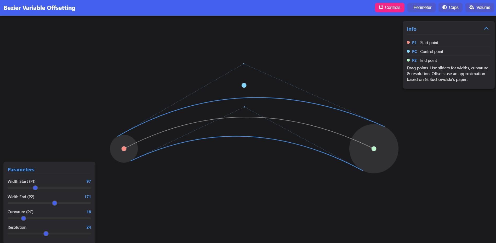

# Proyecto: Bezier Variable Offsetting

## Acceso Rápido a la Aplicación
[XOCOBEZIER](https://xococode.github.io/xocobezier/BezierVariableOffsetting.html)

## Descripción general
Una aplicación interactiva para visualizar y ajustar offsets variables de curvas cuadráticas de Bézier. Permite al usuario modificar puntos clave y parámetros de forma dinámica, viendo al instante cómo cambia la geometría resultante.

---

## Interfaz de usuario

### Lienzo principal
- **Canvas a pantalla completa** donde se dibujan:
  - La curva central (en gris).
  - Las curvas de offset (en azul).
  - El perímetro y relleno opcionales (en magenta).
  - Puntos de control arrastrables (P1, PC y P2).

### Barra superior
- **Título de la aplicación**: “Bezier Variable Offsetting”.
- **Botones de modo**:
  - **Controls**: Muestra u oculta los puntos de control y la geometría auxiliar.
  - **Perimeter**: Activa/desactiva el dibujo del perímetro exterior.
  - **Caps**: Añade extremos redondeados a las curvas de offset.
  - **Volume**: Rellena el área cerrada definida por la curva de offset.

### Panel de información (“Info”)
- **P1**: Punto inicial de la curva.
- **PC**: Punto de control, que define la curvatura.
- **P2**: Punto final de la curva.
- **Texto descriptivo**: Breve explicación sobre el funcionamiento básico.

### Panel de parámetros (“Controls”)
- **Ancho inicial (P1)**: Ajusta la anchura de offset en el extremo de inicio.
- **Ancho final (P2)**: Ajusta la anchura de offset en el extremo de fin.
- **Curvatura (PC)**: Modifica la posición del punto de control para variar la curvatura.
- **Resolución**: Define cuántos segmentos se usan para aproximar las curvas y el perímetro.

---

## Funcionalidades clave

1. **Arrastrar puntos**
   - Pulsa y arrastra P1, PC o P2 sobre el lienzo para reposicionarlos.
   - La curva y los offsets se actualizan en tiempo real.

2. **Ajuste de parámetros**
   - Desliza los controles de la barra lateral para cambiar:
     - Ancho de los extremos de la banda.
     - Intensidad de la curvatura.
     - Precisión del trazado.

3. **Modos de visualización**
   - **Controles**: Muestra u oculta la geometría auxiliar (líneas y rectángulos indicativos).
   - **Perímetro**: Dibuja el contorno de la banda resultante.
   - **Extremos redondeados**: Añade “caps” circulares en los extremos.
   - **Relleno**: Colorea el área encerrada entre las curvas de offset.

4. **Adaptabilidad**
   - La aplicación se redimensiona automáticamente al cambiar el tamaño de la ventana.
   - Los puntos de control conservan su posición relativa.

---

## Cómo usar

1. **Selecciona un modo** en la barra superior.
2. **Arrastra los puntos** P1, PC y P2 para definir la forma de la curva.
3. **Ajusta los sliders** para:
   - Cambiar la anchura en los extremos.
   - Modificar la curvatura.
   - Incrementar o reducir la resolución.
4. **Activa el perímetro, caps o relleno** según necesites visualizar el contorno o el volumen del offset.
5. Observa cómo la banda offset se actualiza al instante con los cambios realizados.

---

## Casos de uso

- Diseño gráfico y tipográfico: crear contornos variables alrededor de trazados.
- Ingeniería y CAD: generar rutas de herramienta con anchura variable.
- Visualización educativa: entender conceptos de offset y curvatura en Bézier.

---

## Descargo de Responsabilidad

**Importante:** El uso de este código es bajo total responsabilidad del usuario. ** Xocostudio** no se hace responsable por ningún tipo de mal uso, daño directo o indirecto, pérdida de datos, o cualquier otro perjuicio que pueda derivarse del uso de este software.

### Sin Garantías

El software se proporciona "tal cual", sin garantías de ningún tipo, ya sean expresas o implícitas. Esto incluye, pero no se limita a, las garantías de comerciabilidad, adecuación para un propósito particular y no infracción.

### Exención de Responsabilidad

Los autores no son responsables por cualquier reclamación, daño u otra responsabilidad que surja del uso del software, ya sea en una acción de contrato, agravio o de otra manera, que surja de, fuera de o en conexión con el software o el uso u otros tratos en el software.

### Uso del Código

Al descargar y utilizar este código, aceptas hacerlo bajo tu propio riesgo. Es tu responsabilidad asegurarte de que el software es adecuado para tus necesidades y de tomar todas las precauciones necesarias para evitar posibles daños o pérdidas.

Si tienes alguna pregunta o necesitas más información, por favor contacta a Xocostudio.

---

*¡Gracias por utilizar nuestro software! Asegúrate de leer y entender este descargo de responsabilidad antes de proceder.*

